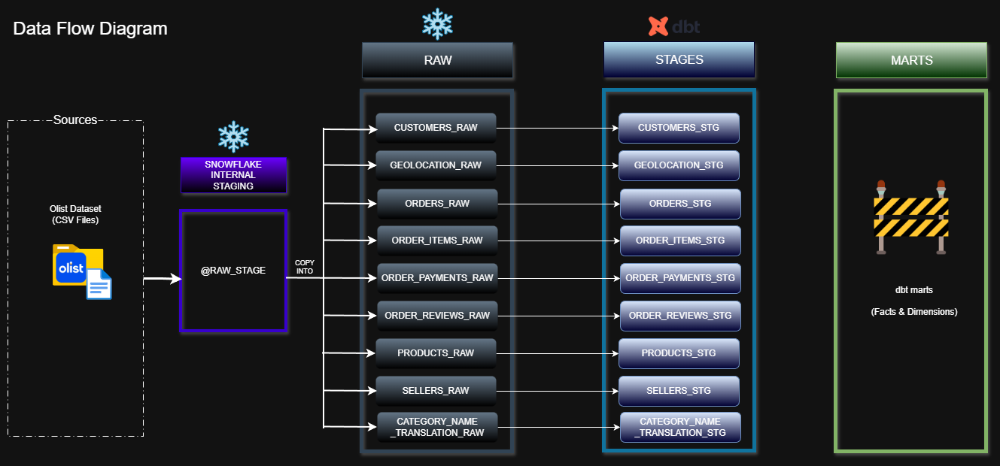

# Project Technical Documentation

This document provides a detailed explanation of the system architecture, data flow, and transformation logic for the Ecommerce Cloud Data Platform.

It complements the main README by focusing strictly on technical implementation details and architectural decisions.

---

## High-Level Architecture

The platform follows a layered ELT architecture:

1. Batch ingestion from flat files  
2. Loading into Snowflake internal stage  
3. Raw schema population using `COPY INTO`  
4. Transformation using dbt (RAW → STAGING implemented)  
5. Marts layer (planned)  
6. Orchestration using Airflow (planned)  
7. Consumption via BI / Analytics layer (future scope)  

---

## Data Flow (Version 2)

The system follows a structured ELT flow:

- **Source:** Kaggle Olist CSV files  
- **Storage:** Snowflake Internal Stage (`@RAW_STAGE`)  
- **Raw Layer:** 1:1 source-aligned tables loaded via batch ingestion  
- **Staging Layer (dbt):** Implemented — data cleaning, type enforcement, column standardization, and transformation logic  
- **Marts Layer (dbt):** Planned — dimensional modeling (facts & dimensions)  

The staging layer ensures consistency, standardization, and modular transformation before business-level modeling is introduced.

---

## Current Implementation Scope

The project currently includes:

- Snowflake database and schema setup  
- Internal stage configuration  
- Structured batch ingestion using `COPY INTO`  
- Fully implemented RAW layer  
- dbt-based STAGING layer with transformation logic  
- Model organization and testing within dbt  

---

## Key Design Decisions

- ELT instead of ETL (compute handled inside Snowflake)  
- 1:1 Raw schema for traceability and auditability  
- Dedicated staging layer for standardized transformations  
- Modular dbt model structure to support scalability  
- Separation of storage and compute using Snowflake Virtual Warehouse  
- Incremental system evolution (layer-by-layer implementation)

---

## Planned Enhancements

- Dimensional modeling (fact & dimension tables in MARTS layer)  
- Airflow orchestration for pipeline scheduling  
- Incremental loading strategy  
- Automated data quality testing framework  
- CI/CD integration for dbt workflows  
