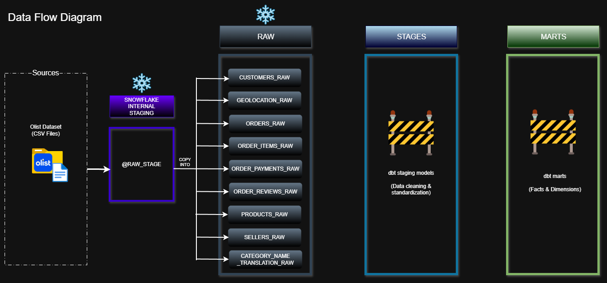

# Project Technical Documentation

This document provides a detailed explanation of the system architecture, data flow, and transformation logic for the Ecommerce Cloud Data Platform.

It complements the main README by focusing on technical implementation details.

## High-Level Architecture

The platform follows a layered ELT architecture:

1. Batch ingestion from flat files
2. Loading into Snowflake internal stage
3. Raw schema population using COPY INTO
4. Transformation using dbt (staging → marts)
5. Orchestration using Airflow
6. Consumption via BI / Analytics layer

## Data Flow (Version 1)

The system follows a structured ELT flow:

- Source: Kaggle Olist CSV files
- Storage: Snowflake Internal Stage (@RAW_STAGE)
- Raw Layer: 1:1 source-aligned tables
- Staging Layer (dbt): Data cleaning & standardization
- Marts Layer (dbt): Fact and Dimension modeling

## Key Design Decisions

- ELT instead of ETL (compute handled in Snowflake)
- 1:1 Raw schema for auditability
- Staging layer for standardized transformations
- Business logic isolated in marts
- Separation of storage and compute using Snowflake Virtual Warehouse

## Planned Enhancements

- dbt-based staging layer
- Dimensional modeling (facts & dimensions)
- Airflow orchestration
- Incremental loading
- Automated data quality testing
