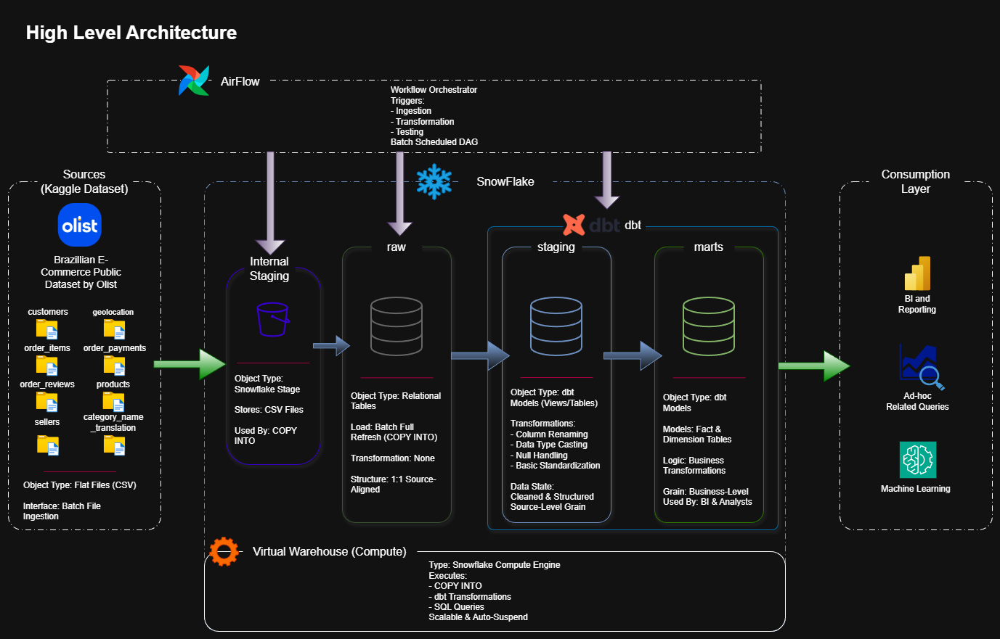
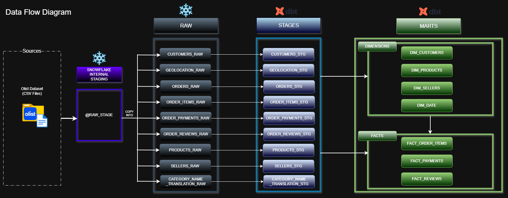

# Project Technical Documentation

This document provides a detailed explanation of the system architecture, data flow, and transformation logic for the Ecommerce Cloud Data Platform.

It complements the main README by focusing strictly on technical implementation details and architectural decisions.

---

## High-Level Architecture

The platform follows a layered ELT architecture:

1. Batch ingestion from flat files  
2. Loading into Snowflake internal stage  
3. Raw schema population using `COPY INTO`  
4. Transformation using dbt (RAW → STAGING → MARTS implemented)  
5. Workflow orchestration using Airflow (planned)  
6. Consumption via BI / Analytics layer (future scope)

---

## Data Flow (Version 3)

The system follows a structured ELT pipeline:

- **Source:** Kaggle Olist CSV dataset  
- **Storage:** Snowflake Internal Stage (`@RAW_STAGE`)  
- **Raw Layer:** Source-aligned tables loaded via batch ingestion using `COPY INTO`  
- **Staging Layer (dbt):** Data cleaning, type enforcement, column standardization, and intermediate transformations  
- **Marts Layer (dbt):** Dimensional modeling with fact and dimension tables designed for analytics workloads  

The layered structure ensures modular transformations, auditability, and clear separation between ingestion, transformation, and analytics modeling.

---

## Current Implementation Scope

The platform currently includes:

- Snowflake database and schema setup  
- Internal stage configuration  
- Structured batch ingestion using `COPY INTO`  
- Fully implemented **RAW layer**  
- dbt-based **STAGING layer** for standardized transformations  
- dbt-based **MARTS layer** implementing dimensional modeling  
- Model organization, documentation, and testing within dbt  

---

## Key Design Decisions

- ELT architecture (transformations executed inside Snowflake)
- 1:1 Raw schema to maintain source traceability
- Dedicated staging layer for standardized data preparation
- Dimensional modeling in the marts layer for analytics consumption
- Modular dbt project structure for maintainability and scalability
- Separation of storage and compute using Snowflake Virtual Warehouse
- Incremental system development through clearly defined architecture layers

---

## Planned Enhancements

- Airflow orchestration for pipeline scheduling
- Incremental loading strategy for large datasets
- Automated data quality monitoring
- CI/CD integration for dbt workflows
- Downstream analytics / BI integration
